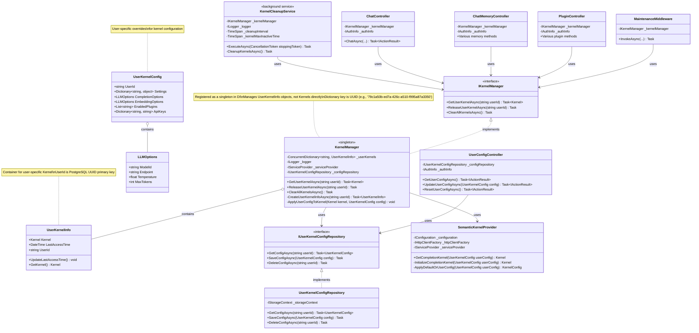

# Chat Copilot Development Guidelines

## Build & Run Commands
- **Backend**: `dotnet run --project webapi/CopilotChatWebApi.csproj`
- **Frontend**: `cd webapp && yarn start`
- **Full App**: `./scripts/Start.ps1` (PowerShell) or `./scripts/start.sh` (Linux/Mac)
- **Run single test**: `dotnet test integration-tests/ChatCopilotIntegrationTests.csproj --filter "FullyQualifiedName~TestName"`
- **Lint frontend**: `cd webapp && yarn lint`
- **Format frontend**: `cd webapp && yarn format:fix`

## Code Style
- **C#**: Use .NET analyzers (already enabled in project)
- **TypeScript**: Use ESLint and Prettier with project settings
- **Imports**: Group by source (framework, then internal)
- **Naming**: 
  - C#: PascalCase for classes/methods/properties, camelCase for variables
  - TypeScript: PascalCase for types/interfaces/components, camelCase for variables/functions
- **Error Handling**: Use try/catch blocks with meaningful error messages
- **Async**: Always use async/await pattern with proper error handling
- **Type Safety**: Use strong typing, avoid 'any' in TypeScript
- **Components**: Create small, reusable components with props interfaces
- **Documentation**: Add XML comments to C# public APIs, JSDoc to complex TypeScript functions
- **Authentication**: Follow MS Identity patterns for auth features

## Per-User Kernel Implementation Class Diagram

