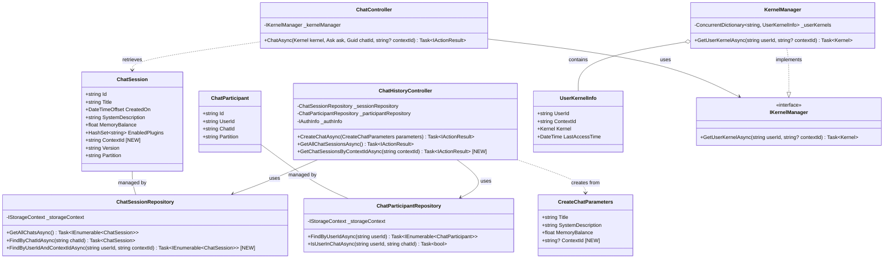

# Chat Copilot Development Guidelines

## Build & Run Commands
- **Backend**: `dotnet run --project webapi/CopilotChatWebApi.csproj`
- **Frontend**: `cd webapp && yarn start`
- **Full App**: `./scripts/Start.ps1` (PowerShell) or `./scripts/start.sh` (Linux/Mac)
- **Run single test**: `dotnet test integration-tests/ChatCopilotIntegrationTests.csproj --filter "FullyQualifiedName~TestName"`
- **Lint frontend**: `cd webapp && yarn lint`
- **Format frontend**: `cd webapp && yarn format:fix`

## Authentication Notes

When the authentication type is set to `None` in the configuration, all requests are processed by the `PassThroughAuthenticationHandler`, which supports two custom headers:

- `X-User-Id`: Custom user ID for the request (if not provided, uses default ID "c05c61eb-65e4-4223-915a-fe72b0c9ece1")
- `X-User-Name`: Custom user name for the request (if not provided, uses "Default User")

These headers allow you to simulate different users even when using the pass-through authentication handler.

## Kernel & Qdrant Collection Management

Each user can have multiple kernels, each associated with a unique context ID. Each user-context kernel pair gets a dedicated Qdrant collection for vector storage, providing proper data isolation.

### Qdrant Collection Naming

Collections are automatically created with a predictable naming pattern:
```
cc_{normalizedUserId}_{contextId}_{type}
```

Where:
- `cc_` is a prefix identifying Chat Copilot collections
- `normalizedUserId` is the user ID with special characters replaced by underscores
- `contextId` is the context ID (defaults to "default" if not specified)
- `type` is an optional collection type (defaults to "default")

### API Endpoints

The following endpoints are available for kernel and collection management:

#### Get a User Kernel
```
GET /api/kernel/info?contextId={contextId}
```
Returns information about the current user's kernel for a specific context.

#### Create/Refresh a Kernel
```
POST /api/kernel/create
```
Creates or refreshes a kernel for the current user. Body parameters:
```json
{
  "contextId": "optional-context-id",
  "settings": { /* optional custom settings */ }
}
```

#### Release a Kernel
```
DELETE /api/kernel/release/{userId}?contextId={contextId}&releaseAllContexts={true|false}
```
Removes a kernel from memory (the Qdrant collection remains for future use).

#### List Qdrant Collections
```
GET /api/kernel/collections
```
Lists all Qdrant collections for the current user.

#### Delete Qdrant Collections
```
DELETE /api/kernel/collections/{userId}?contextId={contextId}&deleteAllContexts={true|false}
```
Permanently deletes Qdrant collections for a specific user.

### User Isolation

Each user (based on their user ID) gets isolated Qdrant collections, ensuring that:
1. Users can't access each other's vector data
2. Each context (like a specific chat) can have its own isolated memory
3. Vector data persists even when kernels are released or the app restarts

## API Usage Notes

### Chat Messages API

When sending messages to the chat endpoint (`POST /chats/{chatId}/messages`), you must include a `messageType` parameter in the variables array. The correct format is:

```json
{
  "input": "Your message text here",
  "variables": [
    {
      "key": "messageType",
      "value": "Message"
    }
  ],
  "contextId": "default"
}
```

Valid message types:
- `Message`: Standard chat message (most common)
- `Plan`: A message representing a plan
- `Document`: A message related to uploaded documents

This format is required because the underlying `ChatPlugin.ChatAsync` method expects a `messageType` parameter that gets passed from the variables collection. Without this parameter, you'll receive a "Missing argument for function parameter 'messageType'" error.

## Code Style
- **C#**: Use .NET analyzers (already enabled in project)
- **TypeScript**: Use ESLint and Prettier with project settings
- **Imports**: Group by source (framework, then internal)
- **Naming**: 
  - C#: PascalCase for classes/methods/properties, camelCase for variables
  - TypeScript: PascalCase for types/interfaces/components, camelCase for variables/functions
- **Error Handling**: Use try/catch blocks with meaningful error messages
- **Async**: Always use async/await pattern with proper error handling
- **Type Safety**: Use strong typing, avoid 'any' in TypeScript
- **Components**: Create small, reusable components with props interfaces
- **Documentation**: Add XML comments to C# public APIs, JSDoc to complex TypeScript functions
- **Authentication**: Follow MS Identity patterns for auth features

## Multi-Kernel Implementation Class Diagram

```mermaid
classDiagram
    class IKernelManager {
        <<interface>>
        +GetUserKernelAsync(string userId, string? contextId) Task~Kernel~
        +ReleaseUserKernelAsync(string userId, string? contextId, bool releaseAllUserContexts) Task
        +ClearAllKernelsAsync() Task
    }

    class KernelManager {
        <<singleton>>
        -ConcurrentDictionary~string, UserKernelInfo~ _userKernels
        -ILogger _logger
        -IServiceProvider _serviceProvider
        -IUserKernelConfigRepository _configRepository
        +GetUserKernelAsync(string userId, string? contextId) Task~Kernel~
        +ReleaseUserKernelAsync(string userId, string? contextId, bool releaseAllUserContexts) Task
        +ClearAllKernelsAsync() Task
        -CreateUserKernelInfoAsync(string userId, string contextId) Task~UserKernelInfo~
        -ApplyUserConfigToKernel(Kernel kernel, UserKernelConfig config) void
    }
    
    note for KernelManager "Registered as a singleton in DI\nManages UserKernelInfo objects, not Kernels directly\nDictionary key is composite 'userId:contextId'"

    class UserKernelInfo {
        +Kernel Kernel
        +DateTime LastAccessTime
        +string UserId
        +string ContextId
        +UpdateLastAccessTime() void
        +GetKernel() Kernel
    }
    
    note for UserKernelInfo "Container for context-specific Kernel\nContextId identifies specific context (e.g., YouTube channel)"

    class UserKernelConfig {
        +string UserId
        +string ContextId
        +Dictionary~string, object~ Settings
        +LLMOptions CompletionOptions
        +LLMOptions EmbeddingOptions
        +List~string~ EnabledPlugins
        +Dictionary~string, string~ ApiKeys
        +Dictionary~string, object~ ContextSettings
    }
    
    note for UserKernelConfig "User and context-specific overrides\nContextSettings for context-specific data"

    class IUserKernelConfigRepository {
        <<interface>>
        +GetConfigAsync(string userId, string? contextId) Task~UserKernelConfig~
        +GetUserConfigsAsync(string userId) Task~IEnumerable~UserKernelConfig~~
        +SaveConfigAsync(UserKernelConfig config) Task
        +DeleteConfigAsync(string userId, string? contextId) Task
        +DeleteAllUserConfigsAsync(string userId) Task
    }

    class UserKernelConfigRepository {
        -IStorageContext _storageContext
        +GetConfigAsync(string userId, string? contextId) Task~UserKernelConfig~
        +GetUserConfigsAsync(string userId) Task~IEnumerable~UserKernelConfig~~
        +SaveConfigAsync(UserKernelConfig config) Task
        +DeleteConfigAsync(string userId, string? contextId) Task
        +DeleteAllUserConfigsAsync(string userId) Task
        -FindByUserIdAsync(string userId) Task~IEnumerable~UserKernelConfig~~
        -FindByUserIdAndContextIdAsync(string userId, string contextId) Task~IEnumerable~UserKernelConfig~~
    }

    class LLMOptions {
        +string ModelId
        +string Endpoint
        +float Temperature
        +int MaxTokens
    }

    class SemanticKernelProvider {
        -IConfiguration _configuration
        -IHttpClientFactory _httpClientFactory
        -IServiceProvider _serviceProvider
        +GetCompletionKernel(UserKernelConfig userConfig) Kernel
        -InitializeCompletionKernel(UserKernelConfig userConfig) Kernel
        -ApplyDefaultOrUserConfig(UserKernelConfig userConfig) KernelConfig
    }

    class KernelCleanupService {
        <<background service>>
        -IKernelManager _kernelManager
        -ILogger _logger
        -TimeSpan _cleanupInterval
        -TimeSpan _kernelMaxInactiveTime
        +ExecuteAsync(CancellationToken stoppingToken) Task
        -CleanupKernelsAsync() Task
    }
    
    class UserConfigController {
        -IUserKernelConfigRepository _configRepository
        -IAuthInfo _authInfo
        -IKernelManager _kernelManager
        +GetUserConfigAsync(string? contextId) Task~IActionResult~
        +GetAllUserConfigsAsync() Task~IActionResult~
        +UpdateUserConfigAsync(UserKernelConfig config) Task~IActionResult~
        +ResetUserConfigAsync(string? contextId) Task~IActionResult~
        +ResetAllUserConfigsAsync() Task~IActionResult~
    }

    class ChatController {
        -IKernelManager _kernelManager
        -IAuthInfo _authInfo
        +ChatAsync(...) Task~IActionResult~
    }

    class ChatMemoryController {
        -IKernelManager _kernelManager
        -IAuthInfo _authInfo
        +Various memory methods
    }

    class PluginController {
        -IKernelManager _kernelManager
        -IAuthInfo _authInfo
        +Various plugin methods
    }

    class MaintenanceMiddleware {
        -IKernelManager _kernelManager
        +InvokeAsync(...) Task
    }

    IKernelManager <|.. KernelManager : implements
    KernelManager o-- UserKernelInfo : contains
    KernelManager --> SemanticKernelProvider : uses
    KernelManager --> IUserKernelConfigRepository : uses
    IUserKernelConfigRepository <|.. UserKernelConfigRepository : implements
    UserKernelConfig o-- LLMOptions : contains
    KernelCleanupService --> IKernelManager : uses
    UserConfigController --> IUserKernelConfigRepository : uses
    UserConfigController --> IKernelManager : uses
    ChatController --> IKernelManager : uses
    ChatMemoryController --> IKernelManager : uses
    PluginController --> IKernelManager : uses
    MaintenanceMiddleware --> IKernelManager : uses
```



## Channel-Specific Chat Implementation Class Diagram

