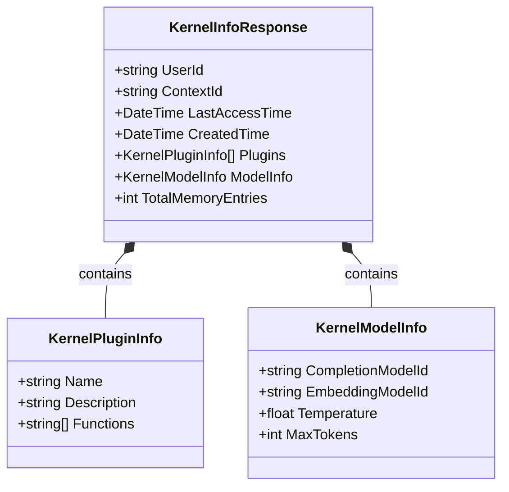
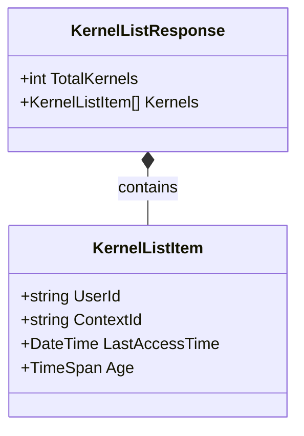
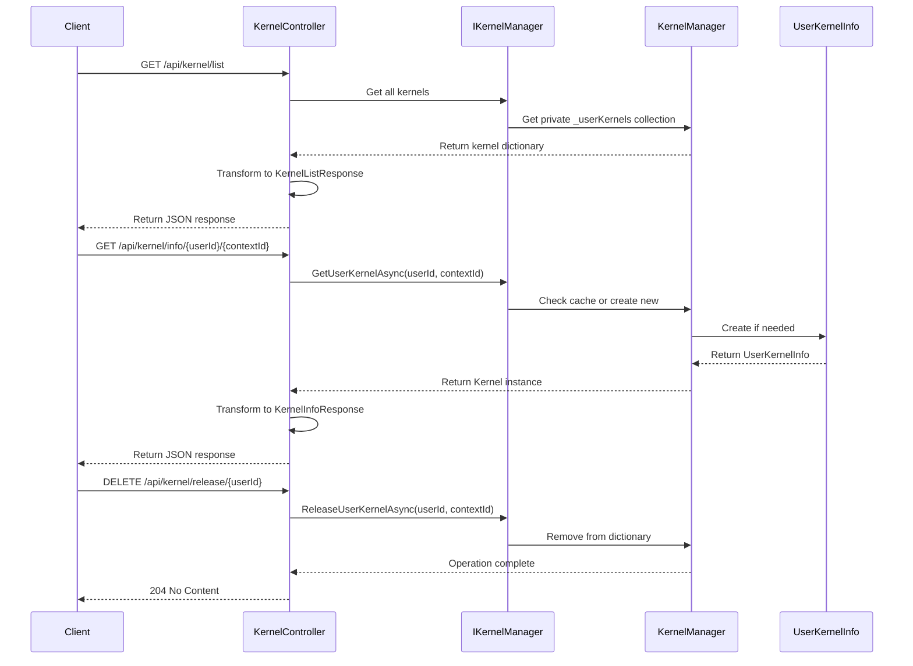

# Kernel Manager API Design

## Overview
This document outlines the design for adding Swagger endpoints to interact with the KernelManager service in Chat Copilot. These endpoints will allow administrators and users to view and manage kernel instances through a RESTful API.

## Goals
- Expose kernel management functionality via REST API
- Provide visibility into active kernels in the system
- Allow administrators to manage kernels across users
- Enable users to view and manage their own kernels
- Maintain proper security boundaries

## API Endpoints

### List All Kernels (Admin Only)
- **Endpoint**: `GET /api/kernel/list`
- **Description**: Returns a list of all active kernels in the system
- **Authorization**: Admin users only
- **Response**: KernelListResponse

### Get Current User's Kernel Info
- **Endpoint**: `GET /api/kernel/info`
- **Description**: Returns information about the current user's kernel
- **Authorization**: Authenticated users
- **Response**: KernelInfoResponse

### Get Specific Kernel Info (Admin Only)
- **Endpoint**: `GET /api/kernel/info/{userId}/{contextId?}`
- **Description**: Returns information about a specific user's kernel
- **Authorization**: Admin users only
- **Parameters**:
  - `userId`: The user ID
  - `contextId` (optional): The context ID (defaults to "default")
- **Response**: KernelInfoResponse

### Release Current User's Kernel
- **Endpoint**: `DELETE /api/kernel/release`
- **Description**: Releases the current user's kernel
- **Authorization**: Authenticated users
- **Query Parameters**:
  - `contextId` (optional): The context ID (defaults to "default")
  - `releaseAllContexts` (optional): Whether to release all contexts for the user
- **Response**: 204 No Content

### Release Specific Kernel (Admin Only)
- **Endpoint**: `DELETE /api/kernel/release/{userId}`
- **Description**: Releases a specific user's kernel
- **Authorization**: Admin users only
- **Parameters**:
  - `userId`: The user ID
- **Query Parameters**:
  - `contextId` (optional): The context ID (defaults to "default")
  - `releaseAllContexts` (optional): Whether to release all contexts for the user
- **Response**: 204 No Content

### Clear All Kernels (Admin Only)
- **Endpoint**: `DELETE /api/kernel/clear`
- **Description**: Clears all kernels in the system
- **Authorization**: Admin users only
- **Response**: 204 No Content

## Response Models

### KernelInfoResponse

### KernelListResponse

## API Flow Diagram

## Implementation Plan

1. **Create a new KernelController**
   - Create a new controller in the `/webapi/Controllers/` directory
   - Ensure it has proper authorization attributes
   - Inject IKernelManager and IAuthInfo

2. **Define API Endpoints**
   - Implement the endpoints as defined above
   - Add proper authorization and validation

3. **Create Response Models**
   - Implement the KernelInfoResponse model
   - Implement the KernelListResponse model

4. **Implement Security**
   - Use AuthInfo to validate user authorization
   - Ensure admin-only functions are properly restricted

5. **Update Service Registration**
   - Ensure the new controller is properly registered in Program.cs

6. **Test the Endpoints**
   - Test with Swagger UI to ensure endpoints work correctly
   - Verify authorization works as expected

7. **Documentation**
   - Add XML comments to all public API methods and models
   - Update README or other documentation if necessary

8. **Create PR**
   - Create a pull request with the changes
   - Include appropriate tests

## Technical Considerations

1. **Authorization Logic**:
   - Determine what makes a user an "admin" (role-based or other criteria)
   - Implement consistent authorization checks

2. **Exposing Internal Details**:
   - Carefully consider what kernel details should be exposed
   - Don't expose sensitive information like API keys

3. **Performance Impact**:
   - Consider the performance implications of listing all kernels
   - Implement pagination if the list could become large

4. **Kernel Creation**:
   - The GET endpoints may create kernels if they don't exist
   - Consider whether this is the desired behavior

5. **Error Handling**:
   - Define consistent error responses
   - Handle cases like user not found, kernel creation failures

6. **Swagger Documentation**:
   - Ensure all endpoints have proper Swagger documentation
   - Use appropriate response types and status codes