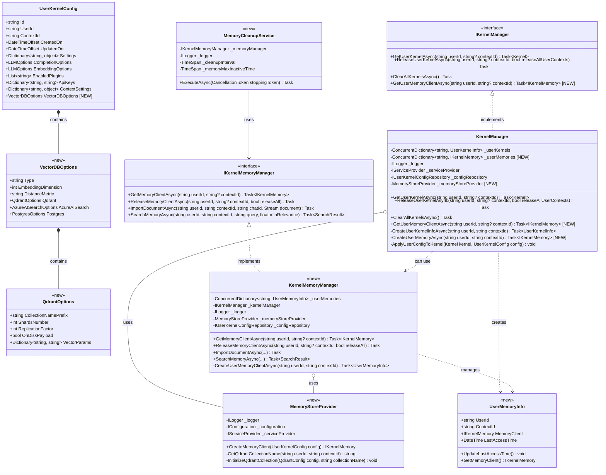

# Qdrant Vector Store Design for Multi-User Kernels

## Executive Summary

This document outlines the design for implementing a Qdrant vector store solution for Chat Copilot, enabling isolated vector databases for each user-specific kernel. The implementation will leverage the existing multi-kernel architecture while extending it to support user and context-specific vector collections in Qdrant.

## Background

Chat Copilot currently supports multiple vector store options, but needs an architecture that allows each user-kernel combination to have its own isolated vector store. Qdrant has been selected as the optimal vector database solution due to its performance, scalability, and collection-based isolation capabilities.

## Architecture

### Key Components

1. **Vector Store Integration Layer**
   - New component that manages Qdrant collections for each user-kernel combination
   - Handles collection creation, deletion, and lifecycle management
   - Provides isolated vector storage per user and context

2. **Extended User Configuration**
   - Enhanced `UserKernelConfig` to include vector store settings
   - Support for user-specific embedding dimensions, similarity metrics, and other Qdrant parameters

3. **Kernel Memory Manager**
   - New service to create and manage memory instances aligned with kernel instances
   - Implements caching and cleanup for memory resources

## Class Diagram



## Implementation Roadmap

### Phase 1: Foundation (2 weeks)

1. **Vector Store Configuration (Days 1-3)**
   - Create `VectorDBOptions` and `QdrantOptions` classes
   - Extend `UserKernelConfig` to include vector store configuration
   - Update `UserKernelConfigRepository` to handle the new properties

2. **Qdrant Collection Management (Days 4-7)**
   - Develop `MemoryStoreProvider` class
   - Implement collection naming strategy (`userId_contextId_collection`)
   - Create methods for collection initialization with proper settings

3. **Memory Client Integration (Days 8-10)**
   - Extend `IKernelManager` to support memory client operations
   - Update `KernelManager` to create and manage user memory clients
   - Ensure proper disposal of resources

### Phase 2: Core Functionality (2 weeks)

4. **Memory Management Services (Days 1-5)**
   - Create `IKernelMemoryManager` interface
   - Implement `KernelMemoryManager` class
   - Develop `UserMemoryInfo` class for memory client tracking

5. **Lifecycle Management (Days 6-10)**
   - Implement `MemoryCleanupService` for background cleanup
   - Develop collection pruning and resource management
   - Add metrics and monitoring for vector store usage

### Phase 3: Integration and Testing (2 weeks)

6. **Controller Integration (Days 1-3)**
   - Update `ChatController` to use isolated vector stores
   - Modify `ChatMemoryController` to work with user-specific memories
   - Add admin endpoints for memory management

7. **Testing (Days 4-7)**
   - Unit tests for memory isolation
   - Performance testing under load
   - Security testing for proper isolation

8. **Documentation and Deployment (Days 8-10)**
   - Update documentation
   - Create deployment guide for Qdrant setup
   - Prepare migration plan for existing data

## Implementation Details

### 1. Collection Naming Strategy

Collections in Qdrant will follow this naming pattern:
```
{userId}_{contextId}_{collectionType}
```

For example:
- `user123_default_chat`
- `user123_youtube_channel456_documents`

### 2. Vector Configuration

Each user can configure:
- Embedding dimensions (defaults to 1536 for OpenAI embeddings)
- Distance metric (defaults to cosine)
- On-disk vs. in-memory storage
- Replication factor (for Qdrant cluster deployments)

### 3. Security Considerations

- Strict isolation between user collections
- Proper error handling to prevent data leakage
- Authentication and authorization for Qdrant access
- Encryption for sensitive vector data

### 4. Fallback Strategy

If Qdrant service is temporarily unavailable:
1. Log error and alert administrators
2. Fall back to SimpleVectorDb (in-memory) temporarily
3. Retry Qdrant connection with exponential backoff
4. Once reconnected, sync any cached vectors

## API Changes

1. New configuration options in `appsettings.json`:
```json
{
  "KernelMemory": {
    "Services": {
      "Qdrant": {
        "Endpoint": "http://localhost:6333",
        "APIKey": "optional-api-key",
        "VectorSize": 1536,
        "DefaultCollectionSettings": {
          "ShardNumber": 1,
          "ReplicationFactor": 1,
          "OnDiskPayload": true
        }
      }
    }
  }
}
```

2. Extended `UserKernelConfig` API with vector store options:
```csharp
// Example usage
var config = new UserKernelConfig 
{
    UserId = "user123",
    ContextId = "youtube_channel456",
    VectorDBOptions = new VectorDBOptions 
    {
        Type = "Qdrant",
        EmbeddingDimension = 1536,
        DistanceMetric = "Cosine",
        Qdrant = new QdrantOptions 
        {
            CollectionNamePrefix = "custom_prefix",
            ReplicationFactor = 2
        }
    }
};
```

3. New memory management API methods:
```csharp
// Get a memory client for a specific user and context
var memoryClient = await kernelManager.GetUserMemoryClientAsync(userId, contextId);

// Search user's memory
var results = await memoryClient.SearchAsync("query", filter: GetUserFilter(userId, contextId));

// Import document to user's memory
await memoryClient.ImportDocumentAsync(new DocumentUploadRequest { ... });
```

## Conclusion

This design provides a scalable and secure approach to implementing user-specific vector stores using Qdrant. By leveraging the existing user kernel architecture and extending it with dedicated memory management, we can efficiently isolate each user's vector data while maintaining high performance and security.